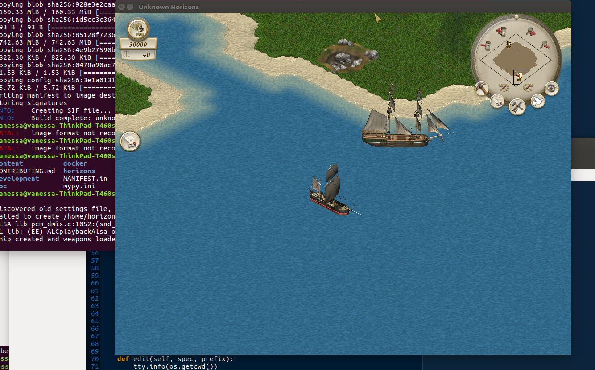

# Running in a Container

This tutorial will cover how to build and run unknown horizons in a container.
Specifically, since we need to access the host video card, we need a container
that is seamless to the host hardware and environment.  [Singularity](sylabs.io/guides/3.1/user-guide/)
containers will let us easily do that, and we can build a container
using Docker that will be pulled into a Singularity container.

## Docker + Singularity

The [Dockerfile](Dockerfile) in this folder represents the build recipe for the
container. Here we install all dependencies, and additionally the
 Fifengine and Fifechan libraries, and then unknown horizons directly from the
repository. Here is how the build can be done locally, from the root of the
repository:


```bash
$ docker build -f docker/Dockerfile -t unknown-horizons .
```

At this point, we need to push to Docker Hub (or other registry) so that we can run
with a Singularity container. Here is how I would tag the container with a different
name, and push:

```bash
$ docker tag unknown-horizons vanessa/unknown-horizons:dev 
$ docker push vanessa/unknown-horizons:dev
```

Great! And now that the container is in a registry, we can easily pull it
into a Singularity container. Note that if you haven't installed Singularity,
you can [do that first](https://www.sylabs.io/guides/3.1/user-guide/quick_start.html#quick-installation-steps).

```bash
$ singularity pull docker://vanessa/unknown-horizons:dev
```

This testing container is available for you to [use](https://hub.docker.com/r/vanessa/unknown-horizons/tags). It was created with commit ``.

This command will pull the container into the present working directory. It's a sif file,
which is a compressed (read only) filesystem that is optimized for running on HPC.
The default name it gets pulled to is `unknown-horizons_dev.sif` (and note you
can rename it, or use --name to specify a different name on pulling.)

```bash
$ ls *.sif
unknown-horizons_dev.sif
```

Finally, you can run it! Just run the container. The entrypoint is the run_uh.py script.

```bash
$ singularity run unknown-horizons_dev.sif
```

The game will open in a window for you to play.



This Docker + Singularity approach is a good production workflow, because it will
allow you to build updated versions on Continuous Integration and release to
Docker Hub, and have users pull the container via Singularity. It doesn't work
well to develop / test since we can't easily use the devices on our machine.
If you need to interactively shell inside:

```bash
$ docker run --entrypoint bash -it unknown-horizons
```

# Singularity

As an alternative, if you don't want to rely on Docker Hub (or Docker at all) you can
just build a Singularity container. The [Singularity](Singularity) recipe in this
folder can build a container on your host directly:

```bash
$ sudo singularity build uh.sif docker/Singularity
```
